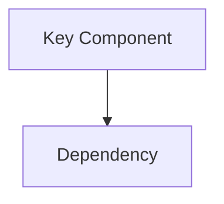

Generate engine documentation — architecture overviews, module references, feature specs, and design guides.

All documentation is written in **English**, output as Markdown files under `docs/`, with an optional PDF export to `docs/pdf/`.

---

## Conventions

### Output Locations

| Format   | Directory   | Tracked in Git |
|----------|-------------|----------------|
| Markdown | `docs/`     | Yes            |
| PDF      | `docs/pdf/` | No (gitignored)|

### File Naming

- Use **kebab-case**: `rendering-pipeline.md`, `plugin-system.md`
- Group by topic with subdirectories when needed: `docs/modules/`, `docs/architecture/`

### Canonical Directory Structure

```
docs/
├── README.md                  # Documentation index / table of contents
├── architecture/
│   ├── overview.md            # High-level engine architecture
│   ├── module-map.md          # Module dependency graph
│   └── build-system.md        # CMake structure and build configuration
├── modules/
│   ├── core.md
│   ├── framework.md
│   ├── render.md
│   ├── physics.md
│   ├── animation.md
│   ├── navigation.md
│   ├── editor.md
│   └── launcher.md
├── plugins/
│   ├── overview.md            # Plugin architecture and registration
│   ├── bullet.md
│   ├── recast.md
│   ├── terrain.md
│   ├── opendrive.md
│   ├── freetype.md
│   ├── compression.md
│   ├── pvs.md
│   ├── guizmo.md
│   ├── python.md
│   └── xr.md
├── features/
│   ├── rendering-pipeline.md
│   ├── shader-system.md
│   ├── asset-pipeline.md
│   ├── material-system.md
│   └── terrain-system.md
├── guides/
│   ├── getting-started.md
│   ├── adding-a-plugin.md
│   └── writing-shaders.md
└── pdf/                       # Generated PDFs (gitignored)
```

---

## Writing Rules

1. **Language**: All documentation MUST be written in English.
2. **Audience**: Engine developers and technical users. Assume C++ and graphics programming familiarity.
3. **Accuracy**: Read the actual source code before writing. Do NOT fabricate APIs, class names, or call flows. Every claim must be grounded in the codebase.
4. **Scope**: Each document covers one topic. Keep documents focused and linkable.
5. **Depth**: Provide enough detail for a developer to understand the design intent, key types, data flow, and extension points. Avoid line-by-line code walkthroughs.
6. **Diagrams**: Use Mermaid fenced blocks (` ```mermaid `) for architecture diagrams, flowcharts, and sequence diagrams. Keep diagrams simple and readable.
7. **Cross-references**: Link between docs using relative paths: `[Render Module](../modules/render.md)`.
8. **Code snippets**: Use fenced code blocks with language tags. Only include short, illustrative snippets — not full source dumps.
9. **Frontmatter**: Every doc file starts with a YAML frontmatter block:
   ```yaml
   ---
   title: "<Document Title>"
   description: "<One-line summary>"
   module: "<engine module or plugin name, if applicable>"
   updated: "<YYYY-MM-DD>"
   ---
   ```
10. **Headings**: Use `##` as the top-level heading inside the document (the title comes from frontmatter). Keep heading hierarchy clean: `##` → `###` → `####`.

---

## Workflow

### Step 1 — Determine Scope

Ask the user (or infer from context) which documentation to generate:
- **Full regeneration**: Rebuild all docs from scratch
- **Single module/plugin**: Generate or update one document
- **Topic/feature**: Write a feature or architecture guide

### Step 2 — Research the Codebase

Before writing ANY documentation:
- Read the relevant source directories and key header files
- Identify the public API surface, major types, and data flows
- Check for existing in-code documentation (comments, READMEs)
- Map dependencies between modules

Use the **Explore subagent** for broad research across multiple modules.

### Step 3 — Generate Markdown

Create or update the `.md` files under `docs/` following the conventions above.

When creating a new document:
1. Write the YAML frontmatter
2. Start with a brief overview paragraph
3. Cover: purpose, key types/classes, architecture/data flow, configuration, extension points
4. Add Mermaid diagrams where they clarify structure
5. Link to related docs

When updating an existing document:
1. Read the current content first
2. Preserve structure and existing accurate content
3. Update only the sections that changed
4. Update the `updated` date in frontmatter

### Step 4 — Update the Index

After creating or modifying docs, update `docs/README.md` to reflect the current table of contents.

### Step 5 — PDF Export (Optional)

If the user requests PDF output:
1. Ensure `docs/pdf/` directory exists
2. Use pandoc (if available) to convert Markdown to PDF:
   ```bash
   pandoc docs/<file>.md -o docs/pdf/<file>.pdf --pdf-engine=xelatex
   ```
3. If pandoc is not installed, inform the user and provide the install command:
   ```bash
   # Windows (via chocolatey)
   choco install pandoc miktex
   # Or download from https://pandoc.org/installing.html
   ```
4. PDF files are gitignored — they are local build artifacts only.

---

## Document Templates

### Module Document Template

```markdown
---
title: "<Module Name>"
description: "<One-line module purpose>"
module: "<module-name>"
updated: "<YYYY-MM-DD>"
---

## Overview

Brief description of what this module does and its role in the engine.

## Architecture



## Key Types

| Type | Description |
|------|-------------|
| `ClassName` | What it does |

## Data Flow

How data moves through this module.

## Configuration

Build flags, runtime settings, etc.

## Extension Points

How to extend or customize this module.

## Dependencies

What this module depends on and what depends on it.
```

### Feature Document Template

```markdown
---
title: "<Feature Name>"
description: "<One-line feature summary>"
updated: "<YYYY-MM-DD>"
---

## Overview

What this feature is and why it exists.

## Design

High-level design decisions and architecture.

## Implementation

Key implementation details across relevant modules.

## Usage

How to use or configure this feature.

## Limitations

Known limitations or planned improvements.
```

---

## Quality Checklist

Before finishing, verify each document against:
- [ ] Written in English
- [ ] YAML frontmatter is present and complete
- [ ] All type/class names match the actual source code
- [ ] Mermaid diagrams render correctly (valid syntax)
- [ ] Cross-references use correct relative paths
- [ ] No fabricated APIs or speculative content
- [ ] `docs/README.md` index is up to date
