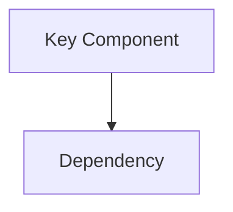

# SkyEngine Documentation Generation

Load this skill when the user wants to create, update, or regenerate technical documentation for SkyEngine.

## Goal

Generate accurate engine documentation for architecture overviews, module references, plugin references, feature guides, and design documents.

All documentation is written in **English**, with Markdown output under `docs/` and optional PDF export to `docs/pdf/`.

## Working rules

- Read the actual source code before writing. Do not invent APIs, classes, configuration keys, or data flow.
- Keep each document focused on a single topic and prefer linkable, modular docs over one giant document.
- Match repository paths, module names, target names, and plugin names exactly.
- Update `docs/README.md` whenever new docs are added or the documentation structure changes.
- Treat `docs/pdf/` as a local artifact directory only; Markdown in `docs/` is the tracked source of truth.

---

## Output conventions

### Output locations

| Format | Directory | Tracked in Git |
|---|---|---|
| Markdown | `docs/` | Yes |
| PDF | `docs/pdf/` | No (`.gitignore`) |

### File naming

- Use **kebab-case** file names such as `rendering-pipeline.md` and `plugin-system.md`
- Group related docs in topic folders such as `docs/architecture/`, `docs/modules/`, `docs/plugins/`, and `docs/features/`
- Preserve existing directory structure when updating current docs

### Canonical structure

```text
docs/
├── README.md                  # Documentation index / table of contents
├── architecture/
│   ├── overview.md            # High-level engine architecture
│   ├── module-map.md          # Module dependency graph
│   └── build-system.md        # CMake structure and build configuration
├── modules/
│   ├── core.md
│   ├── framework.md
│   ├── render.md
│   ├── physics.md
│   ├── animation.md
│   ├── navigation.md
│   ├── editor.md
│   └── launcher.md
├── plugins/
│   ├── overview.md            # Plugin architecture and registration
│   ├── bullet.md
│   ├── recast.md
│   ├── terrain.md
│   ├── opendrive.md
│   ├── freetype.md
│   ├── compression.md
│   ├── pvs.md
│   ├── guizmo.md
│   ├── python.md
│   └── xr.md
├── features/
│   ├── rendering-pipeline.md
│   ├── shader-system.md
│   ├── asset-pipeline.md
│   ├── material-system.md
│   └── terrain-system.md
├── guides/
│   ├── getting-started.md
│   ├── adding-a-plugin.md
│   └── writing-shaders.md
└── pdf/                       # Generated PDFs (gitignored)
```

---

## Writing rules

1. **Language**: All generated documentation MUST be written in English.
2. **Audience**: Assume engine contributors and technical users familiar with C++, CMake, and graphics programming.
3. **Accuracy**: Ground every claim in repository evidence.
4. **Scope**: One document should cover one topic, module, plugin, or feature.
5. **Depth**: Explain design intent, major types, data flow, configuration, and extension points without turning the doc into a line-by-line code dump.
6. **Diagrams**: Use Mermaid fenced blocks for architecture, flow, and dependency diagrams when they help comprehension.
7. **Cross references**: Use relative links such as `[Render Module](../modules/render.md)`.
8. **Code snippets**: Use short fenced code blocks with language tags; prefer examples over large source dumps.
9. **Frontmatter**: Start each document with YAML frontmatter:
   ```yaml
   ---
   title: "<Document Title>"
   description: "<One-line summary>"
   module: "<engine module or plugin name, if applicable>"
   updated: "<YYYY-MM-DD>"
   ---
   ```
10. **Heading structure**: Use `##` as the top-level heading inside the document body because the title lives in frontmatter.

---

## Workflow

### Step 1 — Determine scope

Identify whether the task is:

- full documentation regeneration
- a single module or plugin document
- a focused architecture or feature guide

If the scope is ambiguous, clarify it before writing.

### Step 2 — Research the codebase

Before writing any documentation:

- read the relevant source directories and key headers
- identify public APIs, important types, and major data flows
- check for existing comments, READMEs, and current docs
- map dependencies between modules, plugins, and tools when relevant

Use the `explore` subagent for broad cross-module research.

### Step 3 — Generate or update Markdown

When creating a new document:

1. Write the YAML frontmatter.
2. Start with a short overview paragraph.
3. Cover the document's purpose, key types/classes, architecture or data flow, configuration, and extension points.
4. Add Mermaid diagrams when they clarify the design.
5. Link to related documents.

When updating an existing document:

1. Read the current file first.
2. Preserve correct existing structure and content.
3. Update only the sections that changed.
4. Refresh the `updated` field in frontmatter.

### Step 4 — Update the index

After adding or changing docs, update `docs/README.md` so the table of contents stays accurate.

### Step 5 — Optional PDF export

If the user asks for PDF output:

1. Ensure `docs/pdf/` exists.
2. Use pandoc if available:
   ```bash
   pandoc docs/<file>.md -o docs/pdf/<file>.pdf --pdf-engine=xelatex
   ```
3. If pandoc is unavailable, tell the user and provide an install hint:
   ```bash
   choco install pandoc miktex
   ```
4. Keep PDFs out of git unless the user explicitly asks otherwise.

---

## Document templates

### Module document template

```markdown
---
title: "<Module Name>"
description: "<One-line module purpose>"
module: "<module-name>"
updated: "<YYYY-MM-DD>"
---

## Overview

Brief description of what this module does and its role in the engine.

## Architecture



## Key Types

| Type | Description |
|---|---|
| `ClassName` | What it does |

## Data Flow

How data moves through this module.

## Configuration

Build flags, runtime settings, or registration points.

## Extension Points

How to extend or customize this module.

## Dependencies

What this module depends on and what depends on it.
```

### Feature document template

```markdown
---
title: "<Feature Name>"
description: "<One-line feature summary>"
updated: "<YYYY-MM-DD>"
---

## Overview

What this feature is and why it exists.

## Design

High-level design decisions and architecture.

## Implementation

Key implementation details across relevant modules.

## Usage

How to use or configure this feature.

## Limitations

Known limitations or future improvement areas.
```

---

## Quality checklist

Before finishing, verify that the generated documentation:

- is written in English
- includes complete YAML frontmatter
- uses real type names, module names, and file paths from the repository
- contains valid Mermaid syntax when diagrams are present
- uses correct relative links
- avoids fabricated or speculative content
- keeps `docs/README.md` current
