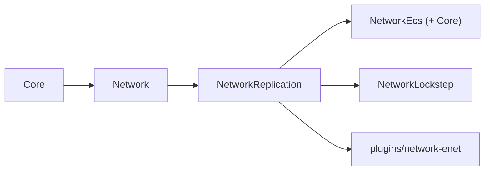

## Overview

`engine/network` is a backend-swappable multiplayer networking stack. It is split into layered targets so the
transport contract, the replication algorithm, and the simulation-model adapters can change independently.
The module follows the repository rule **interfaces and data live in `engine/`, implementations live in
`plugins/`**: `engine/network` holds the contract and backend-agnostic logic, and concrete transports are
plugins (for example [ENet Network Backend](../plugins/network-enet.md)).

| Target | Directory | Links | Contents |
|---|---|---|---|
| `Network` | `engine/network` | `Core` | transport contract, sessions, roles, lanes, lifecycle, statistics |
| `NetworkReplication` | `engine/network/replication` | `Network` | replication algorithm, snapshot codec, encode cache, transport binding |
| `NetworkEcs` | `engine/network/ecs` | `NetworkReplication`, `Core` | data-oriented `core/ecs` source adapter |
| `NetworkLockstep` | `engine/network/lockstep` | `NetworkReplication` | deterministic lockstep, input frames, rollback, desync recovery |



`Network` and `NetworkReplication` contain no `Framework`, plugin, or render dependency, so a dedicated server
can run them from a plain module loop without the world or the render stack.

## Transport contract

| Type | Description |
|---|---|
| `NetworkAddress` | host/port endpoint with IPv4/IPv6 parsing |
| `ConnectionId` | opaque `{index, generation}` handle; a default handle never resolves |
| `DeliveryMode` | `ReliableOrdered`, `ReliableUnordered`, `UnreliableSequenced`, `Unreliable` |
| `NetworkBackendCaps` | backend self-description (delivery/ordering/encryption/topology/threading/`realSendSequence`, channel and payload limits) |
| `INetBackend` / `INetConnection` / `INetListener` | the backend contract |
| `NetworkBackendRegistry` | role-keyed registry (`Client`/`Server`/reserved `Cluster`/`Control`) |
| `NetworkHost` | host-agnostic driver: composes one backend per role, drains events, owns threading/timing |

Backends implement a single I/O primitive, `Pump(sink, maxEvents, waitMs)`. The host selects the threading
policy: `CallerPump` (reference path, deterministic, wasm-safe) or `OwnedThread` (host-owned I/O thread). In
`OwnedThread` mode the host serializes all backend access — outbound sends are deferred to the I/O thread when
a backend is not thread-safe for concurrent send — and user callbacks always run on the caller thread.

## Sessions and lifecycle

`SessionId` is independent of the physical `ConnectionId`, so a session survives a reconnect or a redirect.
`ResumeToken` is a stateless, expiring **HMAC-SHA256** token verified in constant time; no directory service is
required. The host exposes an `Accepting -> Draining -> Closed` state machine with `RedirectTo(address, token)`
for graceful scale-down, and `NetworkHostStats` intended as autoscaler input.

## Replication

`NetworkReplication` is a data-oriented, authoritative replication layer built on the transport:

- **Source seam** (`IReplicationSource`): batched dense iteration over replicated records keyed by a stable
  `ReplicationTypeId`, with opaque byte encoding, optional per-field hooks, and per-connection interest/priority.
- **Snapshot codec** (`SnapshotCodec`): per-connection baseline, delta compression, full/repair snapshots, and
  per-message splitting. Each snapshot carries an application sequence and a full/repair flag; the client applies
  and acknowledges only contiguous deltas or full snapshots, so a single lost delta cannot desynchronize it.
- **Encode cache** (`EncodedRecordCache`): one encode per record per tick, reused across all connections, gated by
  `Revision()`. A record whose revision is unchanged is skipped without encoding (dormancy).
- **Fixed tick** (`ReplicationTick`): bounded accumulator independent of the render frame rate.
- **Interpolation** (`SnapshotInterpolationBuffer`): holds the two most recent payloads and reports an alpha.
- **Transport binding** (`ReplicationHost`): builds per-connection snapshots on the unreliable state channel and
  spawn/despawn/ack events on the reliable event channel.

`NetworkEcs` adapts a `core/ecs` `EntityRegistry` to the source seam with a layout-independent, deterministic
iteration order.

## Lockstep and rollback

`NetworkLockstep` is a host-authoritative deterministic lockstep layer for RTS and rollback netcode:

- **Simulation seam** (`ILockstepSimulation`): advance one fixed tick, capture/restore deterministic state, and
  produce a state hash. Determinism (fixed step, deterministic iteration order, deterministic RNG, deterministic
  math mode) is the implementer's contract.
- **`LockstepHost`**: exchanges input frames on a reliable-ordered channel, blocks a tick until all players'
  inputs arrive, applies a configurable input delay, predicts remote inputs with rollback reconciliation, and
  detects divergence via periodic state hashes with authoritative-state resynchronization.
- **Determinism guard**: `LockstepConfig` requires `DeterministicMathMode::Exact`; a non-deterministic math mode
  is rejected and rollback is unavailable. `DeterministicRng` provides a tick-seeded RNG.

Rollback is bounded (`rollbackMaxFrames`); exceeding the bound requests a resync instead. Deterministic physics
(`PhysicsMathMode::Exact`, Jolt) remains a separate dependency tracked by the physics module.

## Usage

```cpp
sky::net::NetworkHostConfig config;
config.role = sky::net::NetworkRole::Server;

sky::net::NetworkHost host(config);
host.AttachBackend(sky::net::NetworkRole::Server, backend);   // backend owned by a registry/plugin
host.Listen(sky::net::NetworkAddress::Parse("0.0.0.0:7777"));
host.Update();                                               // CallerPump; or Start() for OwnedThread
```

## Configuration

| Switch | Source | Default |
|---|---|---|
| `SKY_BUILD_NETWORK_ENET` | `plugins/plugins.json` | `ON` |
| `SKY_NETWORK_OPENSSL` (compile define) | set when `SKY_BUILD_OPENSSL` and `3rdParty::openssl` exist | off |

## Tests and benchmarks

| Target | Purpose |
|---|---|
| `NetworkTest` | transport contract, lanes, sessions, threading, overflow, lifecycle, crypto vectors |
| `NetworkReplicationTest` | snapshot/delta/baseline/repair, field delta, split, cache, interpolation, loopback end-to-end |
| `NetworkEcsTest` | ECS adapter, field delta, scale, reliability (loss/soak), per-connection AoI |
| `NetworkLockstepTest` | determinism config/RNG, blocking, input delay, rollback, bounded rollback, desync recovery |
| `EnetNetworkTest` | shared conformance suite over real UDP |
| `NetworkBenchmark` | scale, field delta, dormancy, split, AoI, multi-connection, resume token |

Baseline numbers are recorded in `engine/network/replication/bench/BASELINE.md`.

## Known limitations

- The `Framework` `Actor`/`ComponentBase` adapter (`NetworkWorld`) and its world subsystem are deferred pending
  the World/ECS refactor; the data-oriented ECS path is the reference path.
- The core's `OwnedThread` wakeup is a short poll rather than a semaphore wake.
- A backend that cannot carry a sender sequence (for example ENet) reports `realSendSequence = false`; consumers
  use their own application sequence for gap detection.
- Lockstep determinism depends on a deterministic physics backend (`PhysicsMathMode::Exact`, Jolt), which is not
  yet shipped; the lockstep layer is validated against a simplified deterministic simulation.

## Dependencies

- Depends on: `Core` (and `Core` ECS for `NetworkEcs`).
- Depended on by: `plugins/network-enet`; the lockstep layer (`NetworkLockstep`); future prediction.

