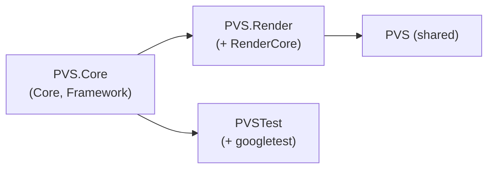

## Overview

`plugins/pvs` implements **precomputed visibility (PVS)**. An offline bake used to render object ids from many
sample points inside editor-authored volumes, read the id buffer back, and pack per-cell visibility bitsets into
per-sector files. At runtime the loader streams sectors around the viewer and answers per-object visibility
queries.

The plugin is split into a **render/editor-independent core** and an **isolated legacy-render runtime glue**. The
legacy editor adaptation (bake pipeline, volume component) has been removed, not migrated.

| Build switch | Source | Default |
|---|---|---|
| `SKY_BUILD_PVS` | `plugins/plugins.json` | `ON` |

## Targets

| Target | Type | Links | Contents |
|---|---|---|---|
| `PVS.Core` | STATIC | `Core`, `Framework` | grid config, sector storage, streaming loader, visibility query, serialization |
| `PVS.Render` | STATIC | `PVS.Core`, `RenderCore` | legacy `IRenderSceneCulling` implementation, runtime module, debug visualizer |
| `PVS` | SHARED | `PVS.Render` | runtime module entry (`runtime/Registry.cpp`) |

`PVSTest` links only `PVS.Core`, so the core logic is exercised without the legacy render stack or any editor
dependency.

## Data model

Grid and storage types live in `runtime/core/include/pvs`:

- `PVSConfig` - `worldOffset`, `cellSize`, `cellSizeY`, `cellsInSectorXZ` (default 8), `cellsPerChunk` (default 16).
  Provides floor-based world -> cell -> sector coordinate conversion that is correct for negative coordinates.
- `PVSCell` - a cell's `chunkIndex` and `dataOffset` into its sector chunk storage. `chunkIndex == ~0` means the
  cell is not allocated.
- `PVSChunk` - a byte buffer holding visibility bitsets for `cellsPerChunk` cells.
- `PVSSector` - `version`, `chunkSize`, the cell table and the chunks. `chunkSize / cellsPerChunk` is the per-cell
  visibility data size.

A sector is a square of `cellsInSectorXZ x cellsInSectorXZ` cells in XZ. Multiple sectors are streamed around the
viewer.

## Visibility primitives

`runtime/core/include/pvs/PVSVisibility.h` holds the render-independent primitives:

- `PVSObjectID` with `INVALID_PVS_OBJECT = 0xFFFFFF00` and `MAX_OBJECTS = (1 << 24) - 2`.
- `PVSVisibilityViewID` - a packed object id: `maskInBytes` (8 bits) plus `indexInBytes` (24 bits).
- `QueryPVSObjectVisible(data, dataSizeInBytes, id)` - the **fail-safe** bit query: when the data is null, the id
  is not a valid object id, or the addressed byte is outside the known size, the object is reported **visible**
  (never culled).

## Streaming loader

`PVSLoader` owns the streamed sector set and a provider:

- `SetProvider(IPVSSectorProvider*)` - abstract source (file-backed `PVSSectorProvider`, or an in-memory provider
  in tests).
- `SetStreamingConfig({ loadRadius, unloadMargin })` - sectors within `loadRadius` are loaded; sectors beyond
  `loadRadius + unloadMargin` are unloaded, giving a **hysteresis band** that avoids load/unload thrashing at
  sector boundaries.
- `Update(pos)` - streams sectors around the viewer position.
- `FindSector(coord)` / `QueryVisibility(cellCoord)` - the query resolves the sector that actually contains the
  cell (including streamed neighbor sectors) and returns the cell's visibility bytes, or `nullptr` when
  unavailable (callers then fail safe).
- `GetCellDataSize()` / `GetMissingSectorCount()` - per-cell byte size (derived from a loaded sector) and the count
  of load attempts whose sector data was absent (recorded without failing the update).

Sector loading is currently synchronous on the calling thread.

## Serialization

The core owns **both** directions of the PVS on-disk format:

- Read: `IPVSSectorProvider` / `PVSSectorProvider` (`LoadHeader`, `LoadSector`).
- Write: `IPVSSectorWriter` / `PVSSectorWriter` (`WriteHeader`, `WriteSector`).

Both file-backed implementations use the workspace file system. Files are named `resource.data` (header/config)
and `PVS_Sector_<x>_<y>.data` (per sector). Keeping reader and writer in the core lets a future bake or external
tool serialize PVS data without re-implementing (and drifting from) the format.

## Legacy runtime glue

`PVS.Render` isolates the legacy-render integration:

- `PVSCulling` implements `IRenderSceneCulling` (legacy `render/RenderScene.h`), loads a PVS header/sector path,
  and answers per-object visibility through `QueryPVSObjectVisible`.
- `PVSModule` is the runtime entry registered through the module system.
- `PVSVisualizer` draws debug geometry.

The plugin is **not** listed in `configs/modules_game.json` or `configs/modules_editor.json`, so `PVS` does not
load in the current launcher/editor path. Re-integrating the runtime culling on Aurora is tracked as a follow-up
change.

## Editor bake (removed)

The editor-side bake pipeline (`PVSEditorModule`, `PVSWorldBuilder`, `PVSBakePipeline`, `PVSVolume`) and the
`PVS.Editor` target were removed. They were bound to the legacy RDG and the legacy Qt editor, and had been
unbuildable when the editor target was enabled. No bake replacement is provided here.

## Tests

`plugins/pvs/test` builds `PVSTest` (requires `-DSKY_BUILD_TEST=ON`) and covers:

- coordinate math (cell/sector conversion, round trips),
- visibility query fail-safe cases (visible, culled, null/out-of-range/invalid id),
- sector streaming (load radius, hysteresis, missing-sector recording),
- neighbor-sector queries,
- `PVSConfig` / `PVSSector` serialization round trips.

`PVSTest` links `PVS.Core` and `googletest` only.
