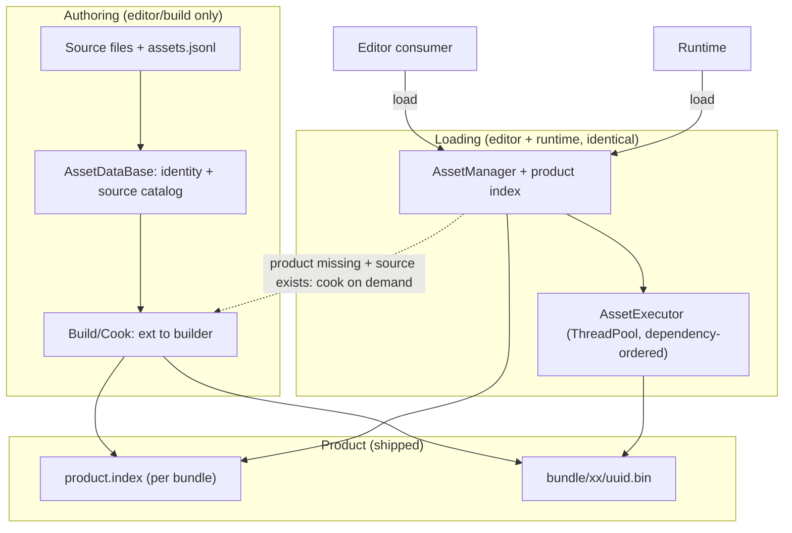

## Context

Source-asset identity is derived from the path: `AssetDataBase::RegisterAsset` computes `Uuid::CreateWithSeed(hash(bundle, path))` every call (`AssetDataBase.cpp:17-23,39-42,122`). References are already `Uuid`, so any rename/move silently breaks them. `assets.db` is a wholesale rewrite of an unordered map (`AssetDataBase.cpp:199-308`) and is also read at runtime for path→uuid. The editor has no rename/move/delete; the only external path-derived identity is the world `persistID` (`Document.cpp:87-93`). Some product payloads still store source paths (legacy `MaterialAsset` JSON, `MaterialAsset.cpp:173-175,227-229`, resolved at `:192-193`). The asset executor uses taskflow although the engine already ships `sky::ThreadPool`.

## Goals / Non-Goals

**Goals:**
- Stable source UUID assigned once, persisted in a per-directory manifest (`assets.jsonl`, JSON Lines), committed to VCS; engine and workspace are ordered mounts in a logical namespace (D12).
- Migration preserves existing references.
- One product-based loading path shared by editor and runtime, with UUID-only product payloads.
- On-demand cook when a product is missing.
- `assets.db` is a dev/build-side cache; the runtime never reads it.
- Asset async on `sky::ThreadPool`; no taskflow in `Framework` code/public headers.

**Non-Goals:**
- Changing the reference form (references stay `Uuid`).
- Per-file sidecars (Unity-style one meta per asset).
- Incremental/freshness build, advanced load scheduling (priorities / single-flight policy — per-uuid dedup of in-flight loads and cooks is in scope), `Uuid::operator<` fix, packaging, legacy/aurora convergence, full engine-wide taskflow removal (D8).

## Decisions

### D1. Per-directory asset manifest (`assets.jsonl`)

- One manifest per physical directory holding registered assets (per mount; a logical path resolves to its owning mount's manifest, D12), committed to VCS in each writable source mount (engine repo tree and workspace tree).
- **Format: JSON Lines** (UTF-8, LF): one asset per line, sorted by `file`; each line is a JSON object `{"file":"<name>","id":"<uuid>"}` with an optional `"cook"` block (D11). One object per line keeps merges line-based (no inter-entry commas).
- Keys only the filename (directory-scoped); sorted output localizes identity changes to one directory so branches only conflict on the directory that changed.

### D2. Identity assignment and resolution

`AssetDataBase::RegisterAsset(path)`:
1. Manifest hit → use that UUID.
2. Miss with a recoverable legacy UUID (`assets.db` row or `CalculateUuidByPath` during migration) → seed the manifest.
3. Miss otherwise → `Uuid::Create()`, write the entry.
4. Write atomically (temp + rename) under the existing `assetMutex`.

`FindAsset(path)` resolves through the manifest (cached); `FindAsset(uuid)` through `idMap`. `assets.db` is a **dev/build-side cache** (source metadata + rebuild acceleration), regenerable, never shipped. World documents (`.world`) are registered as source assets through the same resolver. `CalculateUuidByPath` survives only inside migration. `AssetSourceInfo::name` (markedName) is retained but unused in this change (load-by-name is out of scope); `AssetSourceInfo::dependencies` feeds the source dependency graph (D13).

### D3. Loading model (key normalization + three branches)

Loading accepts a key that is either `Id(uuid)` or `Path(logicalPath)`. It is normalized to an `AssetId` first:

- `Id` → use directly.
- `Path` → **two-level resolution**: (1) `AssetManager`'s product map (D4), shipped and available to editor and runtime; (2) on a miss, and only when the editor source catalog is present, `sourceCatalog.ResolvePath(path)` (recognizes not-yet-cooked sources); (3) still missing → not found.

Then, for the resolved `AssetId`:

1. **Product exists** → deserialize and return. Editor and runtime identical; the source is never read.
2. **Product missing, source exists** → schedule one cook (coalesced per UUID) and return the asset in a **LOADING** state. On cook success it becomes LOADED; on cook failure (build error, no builder, timeout) it becomes **FAILED**. If a cook reports success but the product is still absent, the asset becomes FAILED. A later `LoadAsset` for a FAILED asset re-attempts.
3. **Product missing, source missing** → report the asset as missing (return not-found; no asset).

Notes:
- Source existence means **an `AssetDataBase` record for the UUID**, not the presence of the `assets.db` file (which is uncommitted and may be absent on a fresh checkout).
- The loader MUST NOT use the source catalog for asset **data**; it may only (a) resolve a path to an id and (b) query existence/target to decide whether to cook.
- The source catalog is an editor-injected interface (a source locator, `AssetDataBase`-backed) with `ResolvePath(path)`, `Exists(uuid)`, and `GetTarget(uuid)`; the runtime injects an empty implementation, so paths resolve only through the product map and misses collapse to branch 3.
- A path key (the existing `LoadAssetFromPath(string)`) resolves through the merged product map; the logical path (D12) is unique, so no runtime bundle precedence is needed (mount precedence is applied at build time).
- A pending asset is returned immediately in `LOADING`; `BlockUntilLoaded()` returns once it reaches LOADED or FAILED. Callers MUST NOT block on the asset thread pool.
- Cook failure (no builder, build error, timeout) resolves to a FAILED asset, never a source fallback.
- Dependency loads recurse independently: one load may trigger several cooks. Cooks are coalesced per UUID, and a cook must not self-wait on the loader's pool.

### D4. Product index

The build emits a generated, read-only index per product bundle (`<bundle>/product.index`, JSON Lines `{"path","id"}`), keyed by **logical path → id** (D12; no bundle column). Fields are exactly `path`/`id`; `type`, `name`, provenance, packaging, and `hash` are excluded (added only if needed). **`AssetManager` (the loading layer) owns the product path→uuid map** and loads each bundle's index into it on `AddAssetProductBundle`; it is **level 1** of path resolution (D3), with the editor-only, `AssetDataBase`-backed source catalog as level 2. A logical path resolves to a unique uuid (build-resolved via the mount precedence in D12). The index is distinct from both `assets.jsonl` and `assets.db`, and the runtime ships it instead of `assets.db`.

### D5. Migration

A one-time, idempotent pass scans all mounts (D12; builder-known extensions plus `.world`) and seeds each directory manifest with the **legacy** path-derived UUID — computed from the asset's mount to match the old `(bundle, path)` hash — preserving references written by earlier builds. Because the legacy UUID depended on the bundle, migration keeps an explicit **mount→legacy `SourceAssetBundle` role** mapping (ENGINE/WORKSPACE) to reproduce it exactly. `assets.db`, when present, is an optional cross-check. Only directories containing assets get a manifest. Rollback: delete the manifests; path derivation resumes.

### D6. Source-asset mutation (framework)

Add `IFileSystem` move/rename and `AssetDataBase::{MoveAsset, RemoveAsset, DuplicateAsset}`. Editor UI wiring is deferred to the sandbox editor refactor.
- Import: copy the source into the target writable mount → `RegisterAsset` (create the manifest entry and asset-level cook-config entry) → optionally cook the current platform (default on, configurable). Import does not modify references.
- Move/rename: move file + manifest line, same UUID; references untouched.
- Delete: remove file + manifest line + `idMap`; products are reclaimed by a later build. (Tooling may query dependents first, D13.)
- Duplicate: copy file, assign a **new** UUID (two paths must not share a UUID).

### D7. Cook execution

- **Completion event**: reuse `IAssetEvent::OnAssetBuildFinished`, broadcast per UUID. `AssetBuildResult` is extended to carry `uuid`, `target`, `retCode`, and an error. The `uuid` is required because `Event` passes only the broadcast arguments, not the lookup key (`core/event/Event.h:53-64`). On success the pending asset becomes LOADED; on failure it becomes FAILED (no source fallback).
- **Runners**: an `ICookRunner` with `InProcessCookRunner` (runs `AssetBuilderManager::BuildRequest` on a **separate cook pool**, off the loader pool, D14) and `OutOfProcessCookRunner` (dispatch to a cook process, raise the same event on response). Selected by config; the loading layer depends only on the event.
- **On-demand completion (mode-agnostic)**: `LoadAssetOnDemand` creates the LOADING asset, establishes the wait handle, and dispatches to the `ICookRunner`. The runner — in-process or out-of-process — raises `IAssetEvent::OnAssetBuildFinished` on completion; a build-finished listener resolves the pending load (deserialize then LOADED on success, FAILED on failure; no source fallback) and fulfills the wait handle. The loader therefore has **one** completion path regardless of mode. (Current in-process code uses a direct `BuildRequestSync` + deserialize shortcut; task 10.4 replaces it with this event path so in-process and out-of-process are identical.)
- **Tool (AssetTool)**: a builder-side application, built **independent of `SKY_BUILD_TOOL`**, with two parts:
  1. **Frontend (asset browser)**: browse the source catalog/manifests, inspect the effective cook config, and trigger
     cooks.
  2. **Background worker**: performs **batch cooking** (drain a work list of assets/targets) and doubles as the
     out-of-process cook host.
  The worker is the out-of-process cook host and the migration entry point. Minimal protocol: request
  `{path, target, uuid}`, response `{uuid, target, retCode, error}`; one persistent worker per session, requests queued
  and matched by `uuid`/`target`. **Transport**: spawn the worker and use its standard input/output with length-prefixed
  frames (portable, no platform socket code); worker logs go to stderr.
- **Target(s)**: resolved from the asset-level cook config × project presets × current platform (D11); an asset may target several platforms, producing multiple products (same UUID, per-bundle). Defaults to the primary bundle (`common`) when unconfigured. The source catalog (`GetTarget`) only reports **which targets an asset declares**; the concrete parameters come from the cook config.
- **Index update**: a successful cook (in-process or out-of-process) SHALL append/update the target bundle's `product.index` entry (`path → id`) before raising the completion event, so a subsequent load resolves.

### D8. Asset async executor

Migrate the asset executor off taskflow onto `sky::ThreadPool` (`engine/core/include/core/async/ThreadPool.h`):
- `AssetExecutor` owns one `ThreadPool`; map `dependent_async` → `CreateTask`+`DependsOn`+`Submit`+`GetFuture`, `silent_dependent_async` → `CreateTask`+`Submit`, `WaitForAll` → `WaitIdle`.
- `Asset::AsyncTask` becomes `sky::TaskNodePtr`; `SavingTask` and `AssetManager`'s `tf::AsyncTask` vector become `std::future` / `sky::TaskNodePtr` respectively.
- Drop `<taskflow/taskflow.hpp>` from `Asset.h` and `AssetExecutor.h`.

Scope: this removes taskflow only from Framework's own asset code/headers; `Core` still links it PUBLIC, so Framework's transitive detachment is deferred.

### D9. Asset type identity (`AssetTypeId`)

`AssetSourceInfo::category` is already derived (`builder->QueryType(ext)`, `AssetDataBase.cpp:129`) yet persisted (assets.db). Replace it with a single **`AssetTypeId`**:
- **Source side**: `typeForSource(path) = builderRegistry.QueryType(ext)`; computed, never authored, never written to `assets.jsonl` or `assets.db`.
- **Product side**: the product header carries the `AssetTypeId`; the loader selects the handler by it (existing behavior).
- **Consumers**: type-based selection (`Gather`, validation, preview, grouping) uses `AssetTypeId`; editor wiring is deferred to the sandbox editor refactor.
- Drop the `category` field from `AssetSourceInfo` and its (de)serialization.

Invariant: the same `AssetTypeId` string MUST be used by `AssetTraits<T>::ASSET_TYPE` (compile-time), the builder registry's `QueryType(ext)`, the `AssetManager` handler-registry key (an interned `Name`), the product header `type`, and the editor property metadata `SET_ASSET_TYPE`; a builder returning a type with no registered handler is invalid.

Rationale: one source of truth for type (builder registry for sources, product header for products); avoids drift between the extension, a stored category, and the product type. `name` (markedName, load-by-name) is unrelated and unchanged.

### D10. Format cross-cutting rules

- **Path canonicalization** (all source/index files): canonical `/`, UTF-8, and one agreed Unicode normalization (NFC) applied on both write and query. Lookups are case-sensitive; the build warns on paths that differ only by case.
- **Text everywhere**: `assets.jsonl` / `product.index` are JSON Lines (D1/D4), `configs/asset_cook.jsonc` is JSONC (D11), and `assets.db` is a regenerable JSON cache. `product.index` content is platform-independent and carries only `path`/`id` (D4).

### D11. Cook configuration (project + asset)

- **Project-level** cook config (text, committed): `configs/asset_cook.jsonc` (falls back to the legacy `asset_build_presets.json`) — platform→target presets, per-kind settings (e.g. texture: PC → BC7 + mips, mobile → ASTC 6x6 + mips; compression codec), and the product `bundles`/`presets` (unified with the former `AssetBuilderConfig`). Format is JSON with comments (rapidjson parse-comments flag).
- **Asset-level** override: the optional `cook` block of an asset's line in the per-directory `assets.jsonl` (one file per physical directory per mount, not itself an asset) — `targets`, per-kind parameter overrides, and a free-form `user` block for asset-specific builder parameters.
- **Multi-platform output**: one source asset may emit **multiple products** (one per target). They share the source `uuid`; each target's product lives in its bundle and each bundle's `product.index` maps the path to that id.
- Effective config = asset override × project preset × current platform.
- **Schema**: per-asset (in `assets.jsonl`) `cook.targets` (array of target names), `cook.<kind>` (e.g. `texture.format`, `texture.mips`, `texture.compression`), and `cook.user` (free-form builder parameters). Project-level (`configs/asset_cook.jsonc`) `platforms` (platform→target) and `targets` (target→bundle + per-kind defaults).
- **Compression**: reuse the existing framework `CompressionManager` / `ICompressor` (`framework/compression/Compressor.h`); the dynamically loaded `CompressionModule` registers the lz4 compressor. The cook config selects a codec per target/asset (none/lz4); the product header records the codec; the loader decompresses via `CompressionManager` before deserialization. A compressed runtime requires the module; an uncompressed build needs nothing. The codec module MUST be registered before any compressed product is loaded.

### D12. Mount-based logical namespace (MultiFileSystem)

- Source roots are **mounts** in an ordered `MultiFileSystem` (`core/file/MultiFileSystem.h`): the **workspace mount first and writable**, the **engine mount second and read-only**, with custom/pak/DLC adding more mounts. Earlier mounts shadow later ones.
- The asset key becomes a **single logical path** (relative to the mounted namespace). `SourceAssetBundle`/`sourceBundle` and `GetFileSystemBySourcePath` are removed; precedence is the **mount order** (no hard-coded workspace→engine).
- Registration/import/mutation write through `CreateOrOpenFile`, which routes to the first writable mount.
- **Manifests stay per physical directory** (one `assets.jsonl` per real directory per mount). Resolving a logical path first locates the **owning mount** (the first mount containing the file), then reads that mount's directory `assets.jsonl`, so the file and its manifest always agree.
- `product.index` and cook-config keys become logical paths (no bundle column). Provenance (which mount) is known at resolution time and MAY be cached in `assets.db`, but is not part of the key.
- Because the legacy UUID was derived from `(bundle, path)`, migration keeps an explicit mount→legacy-bundle mapping (D5) to reproduce old UUIDs exactly.

Rationale: reuses an existing, tested overlay filesystem; removes a hard-coded bundle enum; naturally supports overrides, custom roots, and future pak/DLC. This is the "virtual path" direction and is done now to avoid a second key migration.

### D13. Asset dependency graph

- An `IAssetDependencyProvider` (`engine/framework/asset`) exposes forward `Dependencies(uuid)`, reverse `Dependents(uuid)`, and full-graph iteration.
- **Data sources**: at runtime, forward deps come from **product headers** (assembled lazily in `AssetManager`); in the editor/build, from the source deps (`AssetSourceInfo::dependencies`), persisted only as a **derived index** in `assets.db` (cache). The reverse graph is computed by inverting the forward graph.
- **Reverse/full-graph scope**: because `Dependents` and full-graph iteration need every forward edge, they are primarily editor/build-side (or require a full product-header scan at runtime); the runtime normally uses only forward dependencies (load order).
- **Not persisted** in `assets.jsonl` or `product.index` (keeps both minimal and avoids churn).
- **Consumers**: reference lookup, delete/rename impact analysis, unused-asset detection, and (future) incremental rebuild. The interface lives in the consumer's engine module; implementations are `AssetDataBase` (source) and `AssetManager` (product), with no plugin dependency.

### D14. Concurrency, execution, and IPC

- **Execution pools**: loading runs on the asset `ThreadPool` (D8); an in-process cook MUST NOT occupy a loader worker while waiting — it runs on a **separate cook pool** (or otherwise off the loader pool), and `BlockUntilLoaded()` MUST NOT be called from the asset pool.
- **Index writes**: `product.index` updates are read-modify-write and MUST be serialized **per bundle** (lock + atomic temp+rename), or performed by a single index writer, so concurrent cooks never lose entries.
- **Pending loads**: the pending-load table is lock-guarded, and `IAssetEvent` subscription/broadcast is thread-safe (callbacks may run under the lock); a LOADING asset's wait handle is established **before** its cook is scheduled, so `BlockUntilLoaded` unblocks on LOADED/FAILED.
- **Drain**: the asset executor and the cook pool are both drained before persistent state is flushed.
- **IPC frames**: the worker protocol uses a defined length-prefixed frame encoding on **stdout**; worker **logs go to stderr** so they cannot corrupt the stream; partial frames are handled with read/write loops.
- **IPC config**: the worker starts with the **same mount namespace and platform target** as the editor.
- **IPC lifecycle**: on timeout or crash the request fails (D7); the worker restarts on demand and any pending loads are failed/cleaned.

## Loading Flow



Load branch (D3): key normalized to `AssetId` (path via product map, then editor source catalog); **product exists** → deserialize; else **source exists** → on-demand cook (LOADING → LOADED / FAILED); else **not found**.

## Product Layout

Editor/workspace product root is `<workspace>/products/`; runtime bundle roots are per platform. Each bundle holds `<uuid[0:2]>/<uuid>.bin` plus the generated `product.index`.

```
<workspace>/
|-- assets/                     # source tree (mounts; each dir has assets.jsonl)
`-- products/
    |-- common/                 # cross-platform bundle (material/technique/...)
    |   |-- product.index       # path -> id (new)
    |   |-- 3f/
    |   |   `-- 3f9a1c2e-....bin
    |   `-- 7c/
    |       `-- 7c2d4f80-....bin
    |-- tex_pc/                 # BC textures
    |   |-- product.index
    |   `-- ...
    `-- tex_mobile/             # ASTC textures
        |-- product.index
        `-- ...
```

- **Bundle root**: editor `<workspace>/products/<bundle>`; runtime `<root>/<bundle>`.
- **Sharding**: first two hex chars of the UUID string; file name is the full UUID + `.bin`.
- **`product.index`**: one per bundle (`path → id`, JSON Lines).
- **Product header**: inside `<uuid>.bin` (binary: type/deps/version/codec).
- **Multi-target**: the same UUID appears in multiple bundles (one product per platform).

## Test Cases

Behavioral expectations are the spec scenarios; the concrete suites are:

- **Manifest (unit)**: JSON Lines round-trip; sorted output; malformed line tolerated + warning; `RegisterAsset` repeated → same UUID; manifest entry authoritative; migration seeds the legacy `(bundle, path)` UUID via the mount→legacy mapping; mount override (earlier mount wins) and manifest from the owning mount.
- **Mutation (unit)**: move across directories keeps the UUID and updates both manifests; delete removes file + entry + identity (empty manifest removed); duplicate gets a new UUID.
- **Loading (unit/integration)**: by UUID; by path (product-index hit; editor source fallback for an uncooked source; runtime miss → error); missing product + source → LOADING → cook → LOADED; cook failure → FAILED; retry after FAILED; multi-bundle merge (texture in a platform bundle); a material product with a texture UUID loads without the source catalog.
- **Type identity (unit)**: source type derived from extension; no `category` in manifest/dev cache; the type string is identical across `ASSET_TYPE` / `QueryType` / handler key / product header / property metadata; a builder type with no handler is rejected.
- **Cook config / import / compression (unit/integration)**: import assigns identity + cook entry and cooks the current platform; asset override beats preset; project default applies; one texture emits BC + ASTC products under one UUID (per bundle); `cook.user` reaches the builder; a compressed product round-trips with the codec module and an uncompressed one needs no module; a successful cook appends the bundle's `product.index` entry.
- **Dependency graph (unit)**: forward dependencies; reverse dependents by inversion; runtime from product headers; editor graph absent from `assets.jsonl`/`product.index`; deleting a referenced asset reports its dependents.
- **Async executor (unit)**: dependency-ordered load on `ThreadPool`; deep dependency chain completes; drain-before-save waits for all tasks; a compile check that `Asset.h`/`AssetExecutor.h` expose no `tf::`.
- **Concurrency / IPC (integration)**: concurrent cooks on one bundle lose no `product.index` entries; an on-demand cook does not starve the loader pool; the LOADING wait handle exists before the cook; IPC logs on stderr do not corrupt frames; partial frames are handled; the worker uses the editor's mounts; timeout/crash raises a failure and restarts cleanly.

## Risks / Trade-offs

- **Migration ordering** → authority must flip only after manifests are seeded; rollback deletes manifests.
- **Same-directory concurrent adds across branches** → sorted line-based format minimizes conflicts (one line).
- **Mount/manifest consistency** → a logical path's file and its `assets.jsonl` MUST come from the same mount; resolve the owning mount first (D12).
- **Source catalog coupling** → the loading layer depends on a source locator; keep it an interface with an empty runtime implementation.
- **Out-of-process cook** → worker crash/timeout must raise a failure result (never strand a LOADING asset); products and the index are written atomically (temp + rename) before the completion event.
- **ThreadPool semantics differ from taskflow** → verify exception propagation, `WaitIdle` completeness, and nested-graph starvation; add deep-chain tests.
- **Drift (files moved outside the mutation API)** → manifest and disk disagree; out of scope, a later scan/watcher can reconcile.
- **Scope size** → this change carries five capabilities (identity, mutation, loading, cook config, async executor). Land them in the Migration Plan order and keep each step independently buildable/reviewable.

## Migration Plan

1. Introduce the mount-based logical namespace (`MultiFileSystem`; workspace writable first, engine second) and remove `SourceAssetBundle`/`sourceBundle`; add manifest read/write + source resolver with fallback to legacy path derivation.
2. Build the `AssetTool` (asset-browser frontend + batch-cook worker / migration entry).
3. Emit/load the generated product index (generate it for existing bundles without a full rebuild); loading independent of `assets.db`.
4. Run the one-time migration (scan trees + `.world`, seed legacy UUIDs).
5. Flip `RegisterAsset` to assignment-only (worlds are already seeded by the migration scan; steady-state world registration lands with the editor refactor).
6. Editor loads only from products; UUID-only payloads; on-demand cook (D3/D7).
7. Source-asset mutation APIs (move/rename/delete/duplicate); world identity via the resolver (remove `CalculateUuidByPath`).
8. Remove `assets.db` from the runtime bundle; remove taskflow from the asset executor.
9. Cook config (project + asset, incl. compression), multi-platform targets, and import flow (D6/D11).
10. Asset dependency graph: forward from product headers (runtime) / source deps index (editor); reverse by inversion (D13).
11. Concurrency/IPC hardening: separate cook pool, per-bundle index writes, pending-table lock, worker stdout/stderr split (D14).
Rollback: revert code → path derivation resumes; delete manifests.

## Open Questions

- None blocking. (Naming, `product.index` fields, cook-config format, and out-of-process transport are resolved in D7/D10/D11.)
- Mount configuration (which roots are mounted, in what order, and where pak/DLC mounts are added) is set by the application bootstrap and may evolve.
